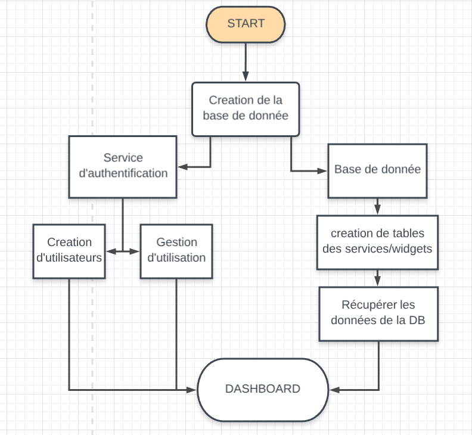

# EpitechDashboardAngular

This project was generated with [Angular CLI](https://github.com/angular/angular-cli) version 6.2.5.

## Build

Run `docker-composer build` to build the project.

## Development server

Run `docker-composer up` then navigate to `http://localhost:8081/`.

## Further help

To get more help on the Angular CLI use `ng help` or go check out the [Angular CLI README](https://github.com/angular/angular-cli/blob/master/README.md).

## Widgets available

1. Weather
2. Calendar
3. Google Map
4. News Feed
5. Youtube

## Services Available
1. Service Météo (OpenWeatherApi)
2. Service Calendar
3. Service Google (Youtube, Google Map => GoogleApi)
4. Service News (NewsApi)

## Projet Conception

* creation de la base de donnée
        * Service d'authentification
                * Création d'utilisateurs
                * Gestion d'utilisation
        * Gestion Base de données
                * Creation de tables des services / Widgets
                        * Récupération des données de la DB

## Widget Settings

If you want to display/desactivate any widget, or set a time refresh, go to the Widget tab on the sidebar. You can also desactivate a widget by clicking on the wheel of each widgets available on your dashboard.

## Users

You can manage your user settings by clicking on your email adress on the right side of the header.